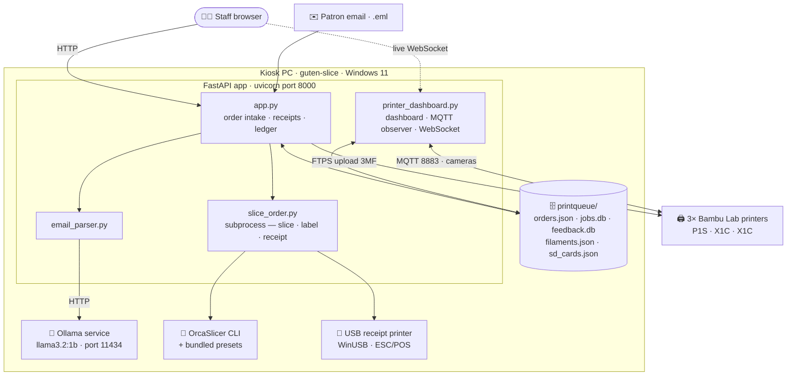
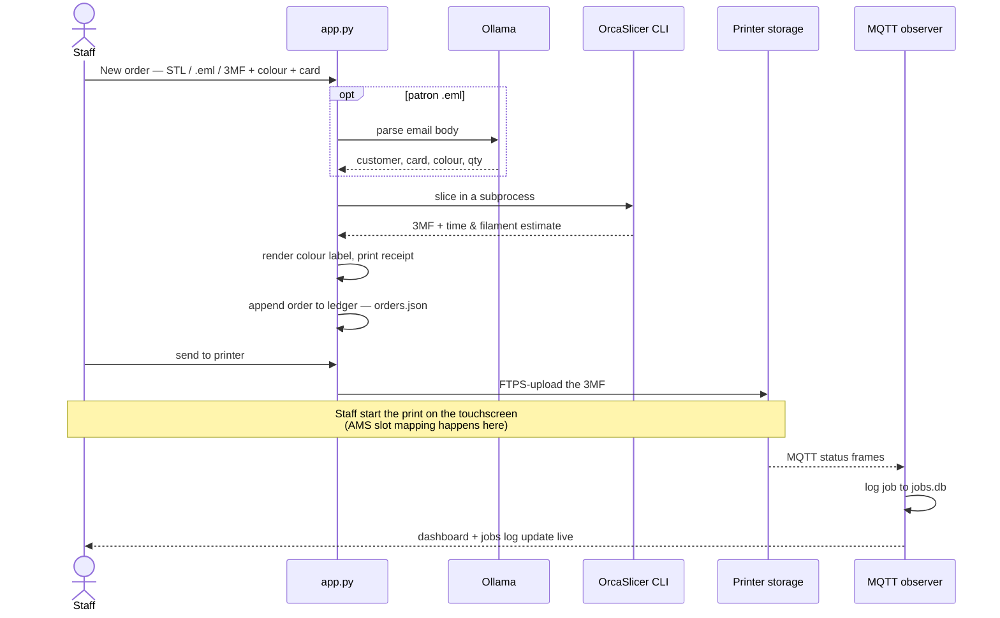

# McLean's Makerspace — 3D Print Intake

A self-hosted web app for running a public-library makerspace 3D-print service.
Staff take an order in the browser, the app **slices it, prices it, prints a
receipt, and sends it to a printer**, then watches every print over MQTT and
keeps a tidy job log. It runs on a single kiosk PC next to the printers.

> **Deployed at:** the McLean branch, on a Windows 11 PC (`guten-slice`), driving
> three Bambu Lab printers. For day-to-day operation and troubleshooting, see
> **[docs/OPERATIONS.md](docs/OPERATIONS.md)**.

---

## Features

- **Three ways to take an order** — upload an STL and slice it, import an
  already-sliced `.3mf`, or drop in a **patron's `.eml`** and let a local LLM
  pull out the name, library card, colour, and quantity.
- **Slicing** via the OrcaSlicer CLI with makerspace defaults (tree supports,
  15% infill, no brim) and per-printer profiles. **AMS multi-colour** slot
  mapping is done on the printer touchscreen.
- **Thermal receipts** with a rendered colour-swatch label (multi-colour blends,
  silk sheen, rainbow/candy gradients).
- **Live dashboard** — printer status, temps, and camera snapshots, updated over
  a WebSocket.
- **Jobs log** — every print the printers report is logged and reconciled against
  the order ledger, with actual filament grams back-filled over FTP.
- **Filament inventory** — staff curate the on-hand colour list and custom swatch
  hexes from a web tab; on-hand colours surface on the dashboard.
- **Staff prints** — one-click free/no-card flow.

---

## Architecture



### Order lifecycle



---

## Tech stack

| Layer | What |
|---|---|
| Web | FastAPI · uvicorn · Jinja2 (Python 3.12) |
| Printers | paho-mqtt (status) · FTPS (file transfer) · RTSPS/TLS (cameras) |
| Slicing | OrcaSlicer CLI (presets from its own install) |
| Receipts | python-escpos over WinUSB (Pillow renders the label) |
| Email intake | local Ollama (`llama3.2:1b`) + regex fallback |
| Storage | JSON ledger + SQLite (`jobs.db`, `feedback.db`) — no external DB |

---

## Repository layout

```
app.py                  FastAPI web app — intake, submit, receipts, ledger
printer_dashboard.py    Dashboard, MQTT observer, WebSocket, FTPS, camera grab
slice_order.py          Slicer/label/receipt CLI (run as a subprocess)
email_parser.py         Patron .eml → structured fields (Ollama + regex)
jobs_db.py              SQLite job log + order reconciliation
feedback_db.py          SQLite patron feedback
import_history.py       One-shot orders.csv → ledger importer
templates/  static/     Jinja2 pages + CSS
process_cli.json        Process overlay the slicer applies (makerspace defaults)
Generic PLA ... .json   Filament base preset
deploy/                 Windows scripts — scheduled-task + Ollama service
                        registration, start-uvicorn.cmd
docs/                   OPERATIONS runbook, architecture, glossary, security
requirements.txt        Pinned dependencies (frozen from the production venv)
```

Per-instance data — `printers.json` (access codes), `printqueue/` (orders, job
DBs, patron files), `filaments.json`, `sd_cards.json`, camera snapshots — is
**gitignored** and lives only on the machine.

---

## Quick start (Windows)

```powershell
py -3.12 -m venv .venv
.venv\Scripts\python.exe -m pip install -r requirements.txt

# Create printers.json (printer IP + access_code + serial per printer),
# then run:
.venv\Scripts\python.exe -m uvicorn app:app --host 0.0.0.0 --port 8000
```

Then open <http://localhost:8000>. External tools must be installed separately:
**OrcaSlicer** (slicing), **Ollama** + `llama3.2:1b` (email intake), and the
**WinUSB driver** for the receipt printer. Boot-time auto-start and the full
setup are covered in **[docs/OPERATIONS.md](docs/OPERATIONS.md)**.

---

## Documentation

- **[docs/OPERATIONS.md](docs/OPERATIONS.md)** — run it, restart it, fix it (Windows).
- **[docs/architecture.md](docs/architecture.md)** — how the pieces fit.
- **[docs/glossary.md](docs/glossary.md)** — domain terms.
- **[docs/security-privacy.md](docs/security-privacy.md)** — MFIPPA / privacy checklist.

---

*Built for the McLean branch makerspace. Patron data handled under MFIPPA — see
[docs/security-privacy.md](docs/security-privacy.md).*
